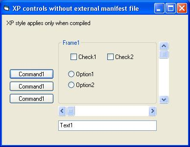



## XP Controls without manifest file

### Description

Don’t do XP controls on WinXP the hard way, add these 2 files to your project, job done. No manifest file required.

The traditional way is to create a manifest file and distribute this along with your program. The more advanced way is to create it dynamically at run time. Both ways are messy and I have seen lots of bad examples and ripped off code on PSC. After this submisson I hope I wont see any more!

This code takes it a step further and gets rid of the manifest file completely and replaces it with a resource which compiles directly into your exe. No more .exe.manifest files!

Please give feedback.
 
### More Info
 

             |
---                |---
**Submitted On**   |2003-11-22 16:33:02
**By**             |[Lee Hughes](https://github.com/Planet-Source-Code/PSCIndex/blob/master/ByAuthor/lee-hughes.md)
**Level**          |Beginner
**User Rating**    |4.4 (22 globes from 5 users)
**Compatibility**  |VB 5\.0, VB 6\.0
**Category**       |[Miscellaneous](https://github.com/Planet-Source-Code/PSCIndex/blob/master/ByCategory/miscellaneous__1-1.md)
**World**          |[Visual Basic](https://github.com/Planet-Source-Code/PSCIndex/blob/master/ByWorld/visual-basic.md)
**Archive File**   |[XP\_Control16751111222003\.zip](https://github.com/Planet-Source-Code/lee-hughes-xp-controls-without-manifest-file__1-50056/archive/master.zip)

